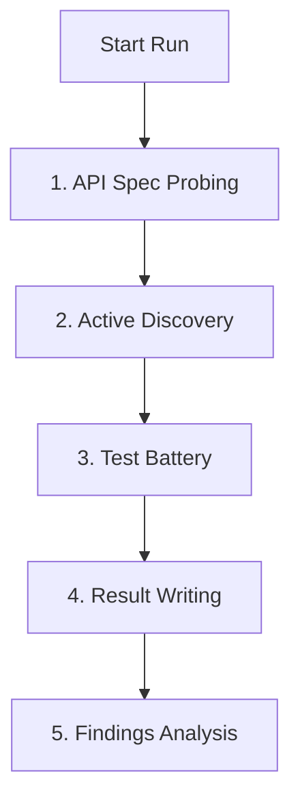

<p align="center">
  
</p>

# BendIt

BendIt is a local API robustness auditing app for developers and security teams. It discovers API endpoints, classifies the discovered surface, runs controlled robustness checks, and stores the evidence as local JSON files.

Use BendIt only against systems you own or are explicitly authorized to test. Some test batteries can change or harm application data, so run them in a controlled environment.

## Current Features

- Local Go backend serving a React dashboard.
- Project registration with `projectId`, base URL, description, headers, and masked auth metadata.
- Backend-owned run pipeline:
  - API spec probing
  - discovery
  - test execution
  - result writing
  - analysis
- OpenAPI / Swagger discovery using common documentation routes.
- OpenAPI path and method extraction with `github.com/getkin/kin-openapi`.
- Safe active discovery probing with `GET`, `HEAD`, and `OPTIONS`.
- Soft-404 baseline detection.
- Endpoint classification and confidence scoring.
- Native API list from `internal/resources/api-list.txt`.
- Custom API list input from the dashboard.
- Per-project local JSON artifacts under `bend-results/`.
- Findings-first results view with raw evidence available separately.
- Theme toggle, project list, progress stepper, and auto-refresh for stored artifacts.

## Run

Build the frontend and backend:

```powershell
cd frontend
npm install
npm run build
cd ..
go build -buildvcs=false -o bendit.exe ./cmd/bendit
```

Start BendIt:

```powershell
.\bendit.exe -addr 127.0.0.1:8080
```

Open:

```txt
http://127.0.0.1:8080
```

Useful flags:

```txt
-addr          HTTP listen address, default 127.0.0.1:8080
-results-dir   directory for generated JSON artifacts, default bend-results
-frontend-dir  directory containing frontend files, default frontend
```

During backend development:

```powershell
go run ./cmd/bendit -addr 127.0.0.1:8080
```

During frontend development:

```powershell
cd frontend
npm run dev
```

## Test

Backend:

```powershell
go test ./...
```

Frontend build validation:

```powershell
cd frontend
npm run build
```

Regenerate the Windows executable:

```powershell
go build -buildvcs=false -o bendit.exe ./cmd/bendit
```

## How It Works

### Execution Pipeline

The backend audit run is entirely **linear** and progresses through five distinct steps sequentially. Only one step is active at a time; parallelization is strictly constrained within individual phases.



1. **API Spec Probing**: Looks for documentation entry points (e.g. Swagger / OpenAPI specifications) and registers found candidate routes.
2. **Active Discovery**: Probes paths using safe methods (`GET`, `HEAD`, `OPTIONS`) to confirm existence and classify them. Normalizes and registers verified endpoints into `endpoints.json`.
3. **Test Battery**: Takes testable endpoints and runs configured robustness check mutations (parallelized via a worker pool).
4. **Result Writing**: Aggregates all test execution data and logs to `results.json`.
5. **Findings Analysis**: Summarizes outcome counts and determines risk highlights for the dashboard.

---

### Test Battery: Step-by-Step Endpoint Lifecycle

Within the **Test Battery** phase, the process runs as follows:

1. **Filtering**: Endpoints are filtered to include only testable classifications (`confirmed`, `protected`, `method_not_allowed`). Paths matching the exclusion patterns list are ignored.
2. **Job Generation**: For every target endpoint, a job is generated for each selected robustness test type (e.g., `idMutation`, `massAssignment`, `requestSize`, `fieldSize`).
3. **Queue Distribution**: These jobs are queued in a single channels pipeline (`chan testJob`).
4. **Parallel Worker Pool Execution**: A pool of concurrent worker goroutines (configurable via `ParallelWorkers`, defaults to `6`) reads from the queue:
   - **Mutation**: The request is mutated according to the test type specifications.
   - **Execution**: The HTTP client executes the request against the target endpoint (attaching masked auth metadata if present).
   - **Evaluation**: The returned HTTP status, headers, and body are verified.
   - **Risk Scoring**: A risk value (0–10) is assigned based on response status changes.
5. **Collection**: Results are gathered, evaluated for findings (risk >= 5), and persisted.

#### Example Scenario

Let's assume the endpoint `GET /api/users/{id}` is discovered with `confirmed` classification. 

If `idMutation` and `fieldSize` are selected in the test battery:
* **Job 1 (`idMutation`)**: Mutates the identifier parameter in the URL.
  * *Original Request*: `GET /api/users/123`
  * *Mutated Request*: `GET /api/users/124`
  * *Audit Goal*: Verify if authorization controls correctly block access to unauthorized records.
* **Job 2 (`fieldSize`)**: Tests maximum field validation limits.
  * *Original Request*: `POST /api/users` with body `{"description": "A"}`
  * *Mutated Request*: `POST /api/users` with body `{"description": "AAAA..."}` (expanded payload size)
  * *Audit Goal*: Check if input validations handle massive string lengths without server failures or overflow.

Both jobs are sent to the worker pool and processed concurrently, but the runner waits until both (and all other endpoint tests) finish before advancing to the **Result Writing** phase.

The current auth fields are persisted only as masked metadata. Raw JWTs, cookies, and API keys are not stored in project/result JSON.

## Local API

Main backend endpoints:

```txt
GET  /api/health
GET  /api/projects
POST /api/projects
GET  /api/projects/{id}
GET  /api/projects/{id}/endpoints
POST /api/projects/{id}/run
GET  /api/projects/{id}/runs/current
GET  /api/projects/{id}/runs/{runId}
GET  /api/projects/{id}/results
```

## Storage

BendIt writes local artifacts under `bend-results/` by default:

```txt
bend-results/
  my-project/
    project.json
    endpoints.json
    results.json
    current-run.json
    runs/
      run-xxxxxxxxxxxx.json
    reports/
```

`endpoints.json` includes discovery metadata such as:

- source and source detail
- HTTP status code
- content type
- response hash and response length
- classification
- confidence
- protected/auth-required flags
- timestamps

Common classifications:

```txt
confirmed
likely_exists
protected
method_not_allowed
maybe_exists
not_found
soft_404
rate_limited
server_error
unknown
```

## API List Format

Custom API lists use one endpoint per line:

```txt
# comments and blank lines are ignored
GET /api/users
POST /api/users
PATCH /api/users/{id}
/health
https://api.example.com/openapi.json
```

Rules:

- Method-prefixed lines use the provided method.
- Lines without a method default to `GET`.
- Relative paths resolve against the project base URL.
- Absolute URLs are accepted.
- Candidates are normalized and deduplicated before storage.

## Safety

BendIt is designed for authorized robustness testing, not exploitation or denial-of-service work.

Current safety defaults:

- Discovery uses safe methods only.
- Robustness tests require a run confirmation in the dashboard.
- Dangerous path patterns can be excluded before running tests.
- Results mask auth context instead of storing raw secrets.
- Test execution is local and project-scoped.

Recommended exclusions for real environments:

```txt
/payment
/charge
/transfer
/withdraw
/delete
```

## Development Notes

Backend:

- Go server entrypoint: `cmd/bendit`
- Server/API layer: `internal/server`
- Discovery and test engine: `internal/engine`
- JSON storage: `internal/storage`
- Built-in route lists: `internal/resources`

Frontend:

- React/Vite app in `frontend`
- Production assets are built into `frontend/dist`
- The Go server serves `frontend/dist` when it exists

## Roadmap

Near-term work:

- Framework default route discovery.
- `robots.txt` and sitemap discovery.
- JavaScript route extraction from same-origin assets.
- Better authenticated discovery with in-memory raw secret handling.
- More detailed discovery evidence views.
- CSV/Markdown/HTML report exporters.

Longer-term ideas:

- Browser-assisted discovery.
- GraphQL and WebSocket support.
- SARIF or CI output.
- Regression comparison between runs.
