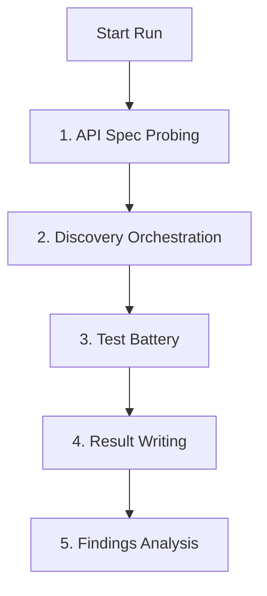

<p align="center">
  
</p>

# BendIt

BendIt is a local API robustness auditing app for developers and security teams. It discovers API endpoints, classifies the discovered surface, runs controlled robustness checks, and stores the evidence as local JSON files.

Use BendIt only against systems you own or are explicitly authorized to test. Some test batteries can change or harm application data, so run them in a controlled environment.

## Current Features

- Local ASP.NET Core backend serving a React dashboard.
- Project registration with `projectId`, base URL, target type (`WebAPI` or `WebPage`), description, headers, and masked auth metadata.
- Backend-owned run pipeline:
  - discovery orchestration
  - test execution
  - result writing
  - analysis
- WebPage JavaScript discovery that runs first for WebPage targets and extracts API routes from same-origin scripts.
- OpenAPI / Swagger discovery using common documentation routes.
- OpenAPI path and method extraction from JSON specifications.
- Safe active discovery probing with `GET`, `HEAD`, and `OPTIONS`.
- Soft-404 baseline detection.
- Endpoint classification and confidence scoring.
- Native API list from `backend/Resources/api-list.txt`.
- Custom API list file attachment from the dashboard.
- Real HTTP test execution with verb-aware test routing and bounded response capture.
- Per-project local JSON artifacts under `bend-results/`.
- Results view grouped by endpoint, with per-endpoint health coverage and drill-down test evidence.
- Project list driven workflow with a dedicated execution page, live progress stepper, and auto-refresh for stored artifacts.

## Run

Build the frontend and backend:

```powershell
cd frontend
npm install
npm run build
cd ..
dotnet build backend\BendIt.Api.csproj
```

Start BendIt:

```powershell
dotnet run --project backend\BendIt.Api.csproj --urls http://127.0.0.1:5000
```

Open:

```txt
http://127.0.0.1:5000
```

During backend development:

```powershell
dotnet watch --project backend\BendIt.Api.csproj
```

During frontend development:

```powershell
cd frontend
npm run dev
```

## Test

Backend:

```powershell
dotnet build backend\BendIt.Api.csproj
```

Frontend build validation:

```powershell
cd frontend
npm run build
```

## How It Works

### Execution Pipeline

The backend audit run is entirely **linear**. The outer runner advances one phase at a time, and `DiscoveryOrchestrator` also runs its discovery sub-steps sequentially. Parallelization is strictly constrained within individual phases.



1. **API Spec Probing**: Prepares the run and loads any existing endpoint artifacts.
2. **Discovery Orchestration**: Runs discovery sub-steps in order:
   - WebPage JavaScript discovery first when `isWebPage` is `true`.
   - OpenAPI / Swagger probing when enabled.
   - Native/custom API-list discovery.
   - Fallback health/spec candidates when no endpoints were found.
   Each sub-step hands candidates to the shared verification stage, which can process candidates in parallel.
3. **Test Battery**: Takes testable endpoints and runs configured robustness checks. Tests are routed by HTTP verb so body-oriented checks run only where request bodies make sense.
   During this phase the runner updates `current-run.json` after completed checks so the dashboard execution page can show live progress, result count, and finding count.
4. **Result Writing**: Aggregates all test execution data and logs to `results.json`.
5. **Findings Analysis**: Summarizes outcome counts and determines risk highlights for the dashboard.

---

### Test Battery: Step-by-Step Endpoint Lifecycle

Within the **Test Battery** phase, the process runs as follows:

1. **Filtering**: Endpoints are filtered to include testable classifications (`confirmed`, `likely_exists`, `protected`, `method_not_allowed`) with confidence >= 60. Paths matching the exclusion patterns list are ignored.
2. **Verb-Aware Job Generation**: For every target endpoint, BendIt creates only the selected jobs that apply to the endpoint method.
   - `GET`, `HEAD`, and `OPTIONS` receive reachability/auth/path-oriented checks such as `authConsistency`, `jwtAnalysis`, `idMutation`, `httpMethodValidation`, and response comparison checks.
   - `POST`, `PUT`, and `PATCH` can also receive body-oriented checks such as `payloadValidation`, `requestSize`, `fieldSize`, `massAssignment`, and `contentTypeValidation`.
   - Body-oriented checks are skipped for `GET`, `HEAD`, and `OPTIONS`; BendIt does not pretend a GET body was tested.
3. **Execution**: The HTTP client executes real requests against the target endpoint. `idMutation` changes path identifier placeholders to a different concrete value, while body checks send configured payload sizes.
4. **Bounded Evidence Capture**: Response bodies are captured from the real API response, capped at 100 KB per test result, with a 5 second request timeout to avoid hanging or large-download traps.
   - **Risk Scoring**: A risk value (0–10) is assigned based on response status changes.
5. **Collection**: Results are gathered, evaluated for findings (risk >= 5), and persisted.

#### Example Scenario

Let's assume the endpoint `GET /api/users/{id}` is discovered with `confirmed` classification. 

If `idMutation` and `fieldSize` are selected in the test battery:
* **Job 1 (`idMutation`)**: Mutates the identifier parameter in the URL.
  * *Original Request*: `GET /api/users/123`
  * *Mutated Request*: `GET /api/users/124`
  * *Audit Goal*: Verify if authorization controls correctly block access to unauthorized records.
* **Job 2 (`fieldSize`)**: Tests maximum field validation limits.
  * *Original Request*: `POST /api/users` with body `{"description": "A"}`
  * *Mutated Request*: `POST /api/users` with body `{"description": "AAAA..."}` (expanded payload size)
  * *Audit Goal*: Check if input validations handle massive string lengths without server failures or overflow.

Both jobs are sent to the worker pool and processed concurrently, but the runner waits until both (and all other endpoint tests) finish before advancing to the **Result Writing** phase.

The current auth fields are persisted only as masked metadata. Raw JWTs, cookies, and API keys are not stored in project/result JSON.

## Local API

Main backend endpoints:

```txt
GET  /api/health
GET  /api/projects
POST /api/projects
PUT  /api/projects/{id}
GET  /api/projects/{id}
GET  /api/projects/{id}/endpoints
POST /api/projects/{id}/run
GET  /api/projects/{id}/runs/current
GET  /api/projects/{id}/runs/{runId}
GET  /api/projects/{id}/results
```

## Storage

BendIt writes local artifacts under `bend-results/` by default:

```txt
bend-results/
  my-project/
    project.json
    endpoints.json
    results.json
    current-run.json
    runs/
      run-xxxxxxxxxxxx.json
    reports/
```

`endpoints.json` includes discovery metadata such as:

- source and source detail
- HTTP status code
- content type
- response hash and response length
- classification
- confidence
- protected/auth-required flags
- timestamps

Common classifications:

```txt
confirmed
likely_exists
protected
method_not_allowed
maybe_exists
not_found
soft_404
rate_limited
server_error
unknown
```

Project `project.json` includes `isWebPage`. When `false`, the project is treated as a WebAPI target, the base URL is normalized to the origin, and JavaScript discovery is skipped. When `true`, the project is treated as a WebPage target, the configured page path is preserved, and JavaScript route extraction runs before the other discovery mechanisms.

## API List Format

Attached custom API lists use one endpoint per line:

```txt
# comments and blank lines are ignored
GET /api/users
POST /api/users
PATCH /api/users/{id}
/health
https://api.example.com/openapi.json
```

Rules:

- Method-prefixed lines use the provided method.
- Lines without a method default to `GET`.
- Relative paths resolve against the project base URL.
- Absolute URLs are accepted.
- Candidates are normalized and deduplicated before storage.

## Safety

BendIt is designed for authorized robustness testing, not exploitation or denial-of-service work.

Current safety defaults:

- Discovery uses safe methods only.
- Robustness tests require a run confirmation in the dashboard.
- Dangerous path patterns can be excluded before running tests.
- Results mask auth context instead of storing raw secrets.
- Test execution is local and project-scoped.

Recommended exclusions for real environments:

```txt
/payment
/charge
/transfer
/withdraw
/delete
```

## Development Notes

Backend:

- ASP.NET Core app in `backend`
- Server/API layer: `backend/Controllers`
- Run pipeline: `backend/Runner`
- Discovery orchestration and steps: `backend/Discovery`
- JSON storage: `backend/Storage`
- Built-in route lists: `backend/Resources`

Frontend:

- React/Vite app in `frontend`
- Production assets are built into `frontend/dist`
- The Go server serves `frontend/dist` when it exists

## Roadmap

Near-term work:

- Framework default route discovery.
- `robots.txt` and sitemap discovery.
- Better authenticated discovery with in-memory raw secret handling.
- More detailed discovery evidence views.
- CSV/Markdown/HTML report exporters.

Longer-term ideas:

- Browser-assisted discovery.
- GraphQL and WebSocket support.
- SARIF or CI output.
- Regression comparison between runs.
